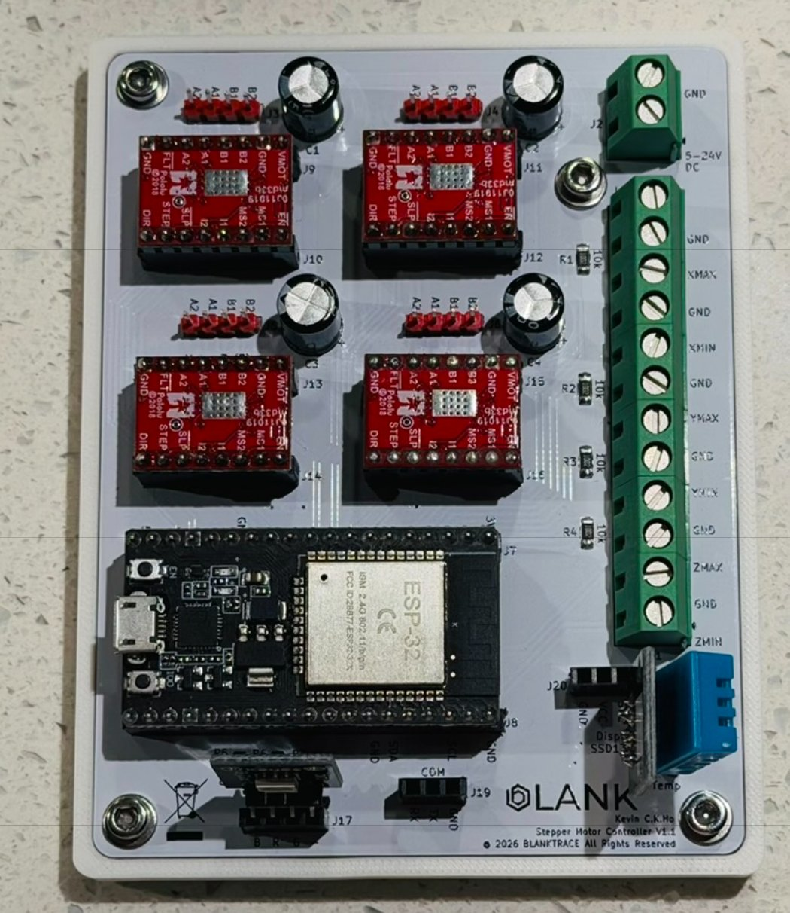
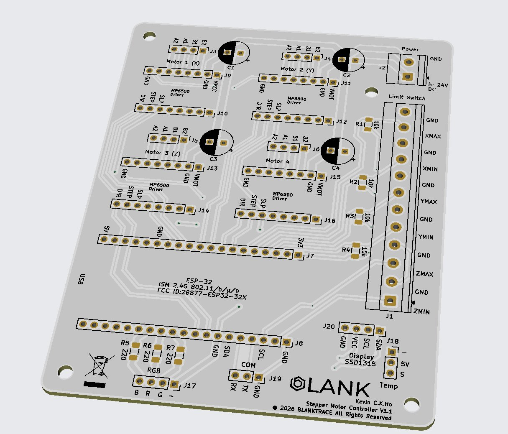
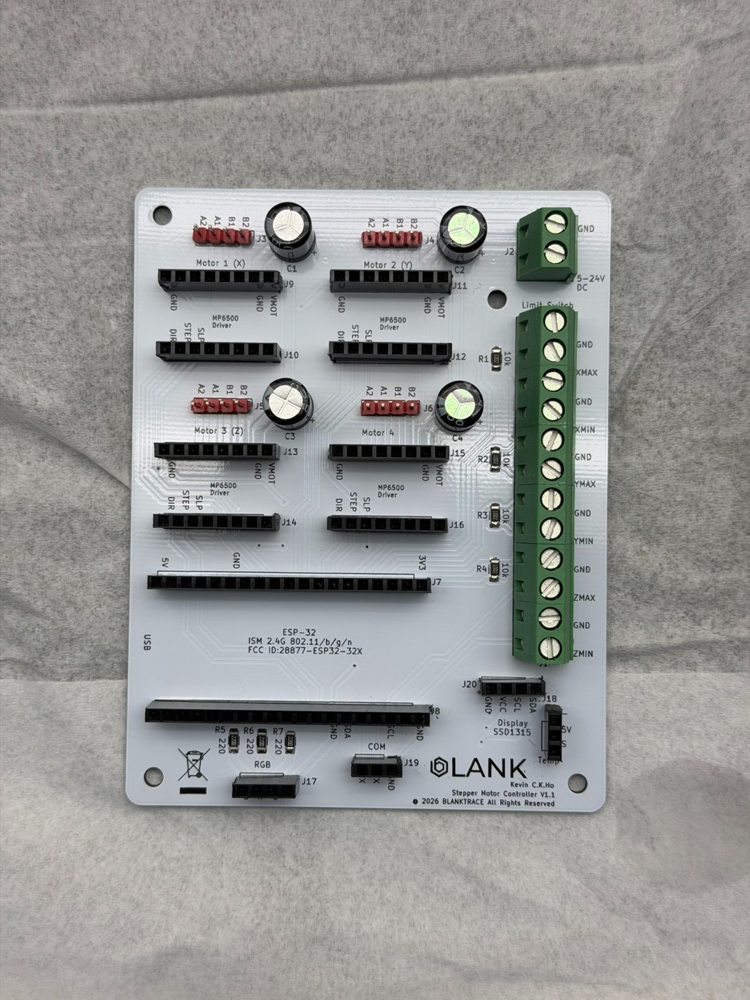
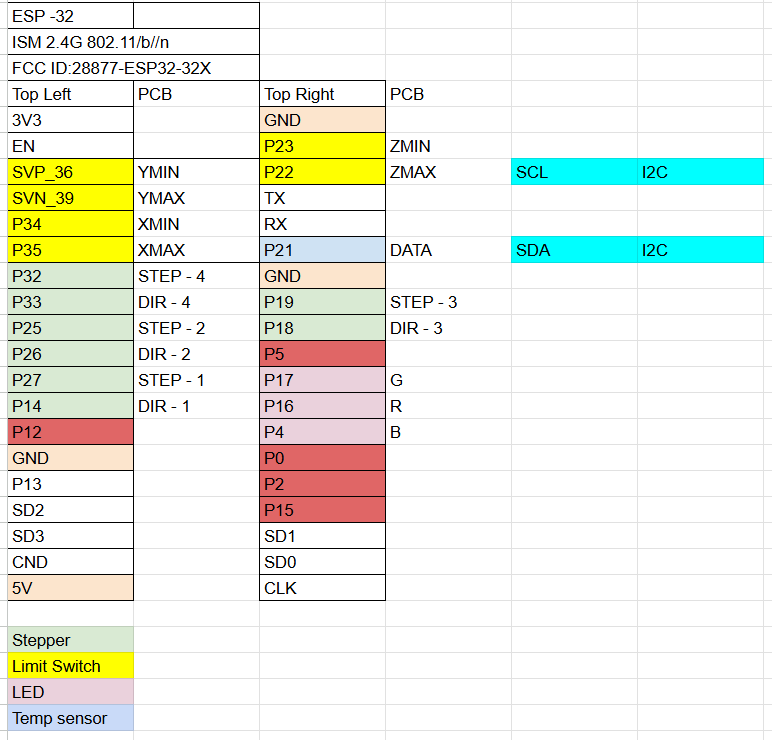

# ESP32 Stepper Motor Breakout Board

A Wi-Fi controlled, 4-axis stepper motor controller built around an ESP32 on a custom breakout PCB. It was designed to drive a motorized microscope stage (the *Microscope Stage Mover*). 

The ESP32 creates its own Wi-Fi access point and serves a web dashboard. From the dashboard you can jog each axis with sliders, trigger an emergency stop, and watch temperature and humidity live.

  

## Repository layout
| Folder | Contents |
|---|---|
| [`firmware/`](firmware) | PlatformIO project for the ESP32 (Arduino framework) |
| [`hardware/`](hardware) | KiCad 10 project for the *ESP32 Stepper Breakout Board* (schematic, PCB) |
| [`hardware/gerbers/`](hardware/gerbers) | Gerber and drill files (rev V1.1), ready to upload to a PCB fab |
| [`docs/images/`](docs/images) | Pinout, render, and board photos |

## Features
- Up to 4 stepper axes (X, Y, Z plus an optional 4th axis enabled from the UI) using Pololu-style **MP6500** driver carriers
- Variable speed and direction for each axis through slider control in the web UI
- 6 limit switches (X/Y/Z min and max) that stop motion in the triggered direction
- Software emergency stop
- **Thermal stop**: a DHT11 sensor halts all motors above 40 °C
- RGB status LED
- 5–24 V DC motor supply input on a screw terminal

## Hardware: ESP32 Stepper Breakout Board (V1.1)
An 85 × 110 mm, 2-layer board.

| KiCad render | Bare PCB |
|---|---|
|  |  |

**Main connectors**
| Ref | Function |
|---|---|
| J7, J8 | ESP32 DevKit (30-pin) sockets |
| J9–J16 | 4 × MP6500 driver sockets (Motor 1 X, Motor 2 Y, Motor 3 Z, Motor 4) |
| J3–J6 | Motor outputs (A2 A1 B1 B2) |
| C1–C4 | Bulk capacitors on VMOT for each driver |
| J2 | Motor power, 5–24 V DC |
| J1 | 12-way limit-switch terminal (switch to GND) |
| J17 | RGB LED (B R G −) with 220 Ω resistors R5–R7 |
| J18 | Temperature sensor (DHT11) |
| J19 | Serial COM (RX TX GND) |
| J20 | I²C display (SSD1315) |

R1–R4 are 10 kΩ pull-ups for limit inputs on GPIO 34/35/36/39. Those pins have no internal pull-ups.

### ESP32 pin map

| Function | GPIO |
|---|---|
| Motor 1 (X): STEP / DIR | 27 / 14 |
| Motor 2 (Y): STEP / DIR | 25 / 26 |
| Motor 3 (Z): STEP / DIR | 19 / 18 |
| Motor 4: STEP / DIR | 32 / 33 |
| X MIN / X MAX | 34 / 35 |
| Y MIN / Y MAX | 36 (SVP) / 39 (SVN) |
| Z MIN / Z MAX | 23 / 22 |
| RGB LED: R / G / B | 16 / 17 / 4 |
| DHT11 data | 21 |
| I²C display SDA / SCL | 21 / 22 (shared with DHT11 and Z MAX) |

## Bill of materials
Also available as [`docs/BOM.csv`](docs/BOM.csv).

| Qty | Ref | Part | MPN / Source |
|---:|---|---|---|
| 1 | J7, J8 | ESP32 ESP-32D development board (30-pin DevKit) | [Amazon](https://www.amazon.com/dp/B0C8HDDNLV) |
| 4 | J9–J16 | MP6500 stepper motor driver carrier | [Pololu #2968](https://www.pololu.com/product/2968) |
| 1 | J18 | Keyes DHT11 temperature & humidity module | — |
| 1 | J17 | Keyes KY-009 3-colour RGB LED module | — |
| 4 | C1–C4 | 100 µF 50 V electrolytic capacitor | — |
| 4 | R1–R4 | 10 kΩ 1% ¼ W, 1206 (limit-switch pull-ups) | Stackpole RMCF1206FT10K0 |
| 3 | R5–R7 | 220 Ω 1% ¼ W, 1206 (RGB LED) | Stackpole RMCF1206FT220R |
| 1 | J1 | Terminal block, 12-pos, 5 mm, side entry | Phoenix Contact 1715129 |
| 1 | J2 | Terminal block, 2-pos, 5 mm, side entry | Phoenix Contact 1715022 |
| 2 | J7, J8 | Female header 1×19, 2.54 mm (ESP32 socket) | — |
| 8 | J9–J16 | Female header 1×8, 2.54 mm (driver sockets) | — |
| 2 | J17, J20 | Female header 1×4, 2.54 mm (RGB / display) | — |
| 2 | J18, J19 | Female header 1×3, 2.54 mm (temp sensor / COM) | — |
| 4 | J3–J6 | Male pin header 1×4, 2.54 mm (motor outputs) | — |

Optional: SSD1315 0.96" I²C OLED display on J20.

## Firmware
Built with [PlatformIO](https://platformio.org/) (VS Code extension).

1. Open the `firmware/` folder in VS Code with PlatformIO installed.
2. Connect the ESP32 over USB and click **Upload**.
3. On your phone or PC, join the Wi-Fi network **`ESP32-Stepper-System2`**. The password is set in `src/main.cpp`; change it before you deploy.
4. Browse to **http://192.168.4.1** to open the control dashboard.

Libraries (installed automatically): Adafruit DHT sensor library, Adafruit Unified Sensor.

## Ordering the PCB
Upload `hardware/gerbers/ESP32 Stepper break out board V1.1.zip` to JLCPCB, PCBWay, or any other fab. Default 2-layer, 1.6 mm settings are fine.

## Author
Kevin C.K. Ho, BLANKTRACE © 2026
